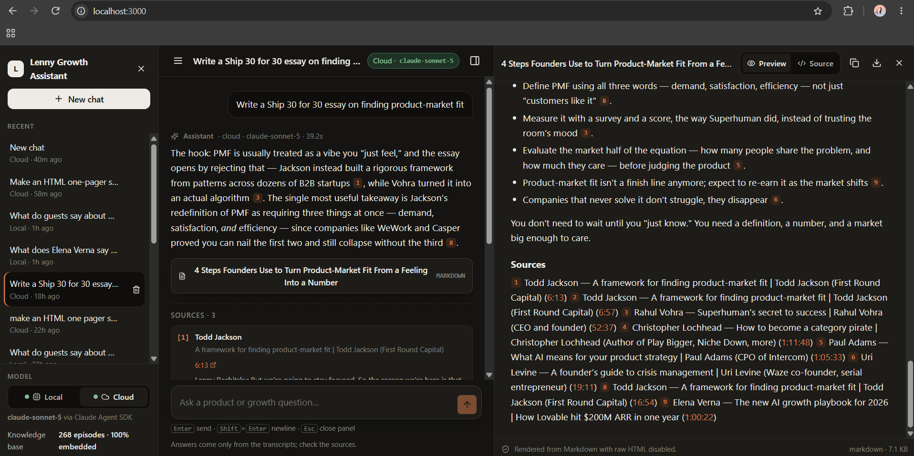
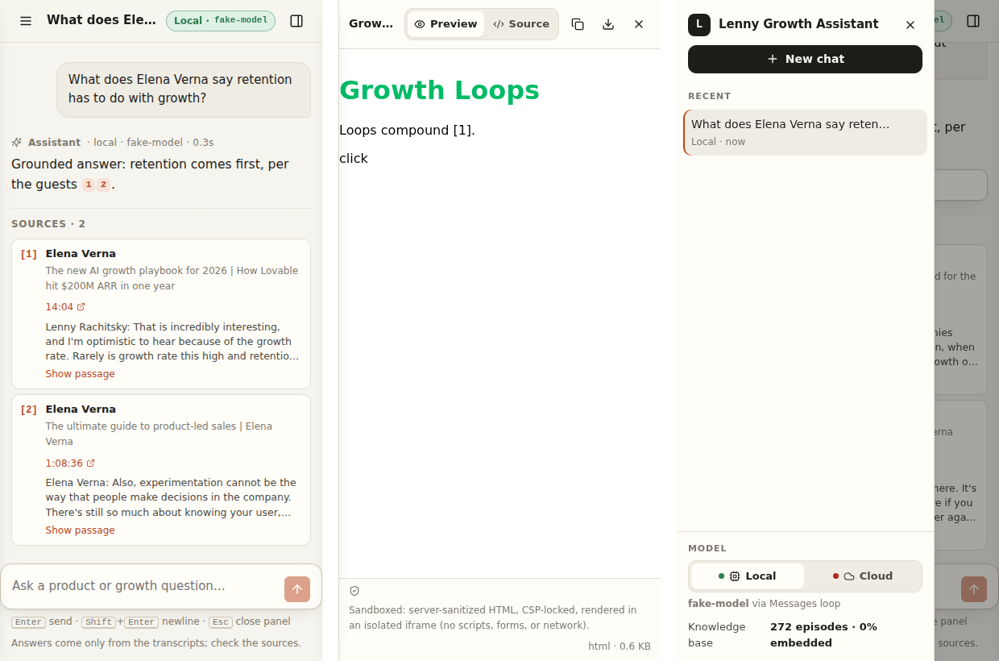

# Design — The Lenny Growth Assistant

The UI has one job: make a grounded answer *feel* trustworthy and make the next step (verify, reuse, share) one click away. Everything below serves that.

## 1. Principles

1. **Trust is a UI feature.** Citations are first-class: numbered chips inline, a Sources block with the verbatim passage and a timestamp link. The user should never have to take the model's word for it.
2. **Every state is visible.** Which model is answering (and whether it's a fallback), what the agent is doing right now (*Searching… Drafting…*), why something failed and what to do about it. No silent spinners.
3. **Restraint over decoration.** One accent colour (terracotta), warm neutrals, real typographic hierarchy, no gradients, no emoji as UI. The content — the guests' words — is the interface.
4. **Keyboard first, mouse second.** Enter sends, Shift+Enter breaks, Esc closes the panel, Tab order follows reading order, everything has a focus ring.
5. **Progressive density.** Empty state teaches with six example prompts; a working session hides the teaching; a long session keeps citations collapsed until asked.

## 2. Information architecture

```
┌ Sidebar (268 px) ─────┐ ┌ Chat (fluid, max 760 px column) ────────┐ ┌ Artifact panel (≤ 46 vw / 720 px) ─┐
│ Brand                 │ │ Header: title · provider pill · panel ⧉ │ │ Title · Preview/Source · Copy ·   │
│ [New chat]            │ │                                          │ │ Download · Close                   │
│ Recent sessions       │ │ Empty state → 6 example prompts          │ │ Tabs (when >1 artifact)            │
│   title / provider /  │ │ or                                       │ │ Rendered artifact                  │
│   recency / delete    │ │ Messages: user bubble · assistant prose  │ │   HTML → sandboxed iframe          │
│ ───────────────────── │ │   activity trace · [n] chips · artifact  │ │   Markdown → react-markdown        │
│ Model: Local | Cloud  │ │   chip · Sources (collapsed passages)    │ │ Footer: sandbox statement · size   │
│ health dot + reason   │ │                                          │ │                                    │
│ Knowledge base stats  │ │ Composer: textarea · send/stop · hints   │ │                                    │
└───────────────────────┘ └──────────────────────────────────────────┘ └────────────────────────────────────┘
```

Hierarchy: *conversation* is primary (centre, widest), *artifact* is a peer that appears only when it exists, *navigation and configuration* are secondary (left, muted).

## 3. Design tokens

| Token | Light | Dark | Use |
|---|---|---|---|
| `--bg` | `#f6f4ee` paper | `#151412` | app background |
| `--bg-elev` | `#fffdf8` | `#1d1c19` | panels, cards, sources |
| `--bg-sunken` | `#efece4` | `#0f0e0d` | inputs, code, user bubble |
| `--ink / -2 / -3` | `#1e1d1a / #4c4a44 / #7c7970` | `#ecebe5 / #bdbab0 / #85827a` | text hierarchy |
| `--accent` | `#b9471f` terracotta | `#e8773f` | links, citations, primary send |
| `--ok / --warn / --err` | green / amber / red | lighter variants | health dots, pills, banners |
| Type | `Inter → system-ui → Segoe UI` 15 px / 1.55; mono for model names and citation numbers | | |
| Radii | 6 / 10 / 14 px | | |
| Shadow | one soft elevation only (composer, artifact chips) | | |

Dark mode follows `prefers-color-scheme`; contrast on body text is ≥ 7:1 in both modes, on muted text ≥ 4.5:1.

## 4. The built interface

The layout above, as shipped. These are screenshots of the running app, not mockups —
every state below was verified in a browser at 1440 px and 400 px.

<p align="center"></p>
<p align="center"><em>Grounded answer, citations with timestamp links, and an HTML artifact rendered in the sandboxed viewer.</em></p>

<p align="center"></p>
<p align="center"><em>The Ship 30 for 30 essay as a Markdown artifact, with the conversation and its sources still in view.</em></p>

<p align="center"></p>
<p align="center"><em>At 400 px: chat, the artifact sheet, and the session drawer — one overlay at a time.</em></p>

## 5. Key interaction states

| State | What the user sees |
|---|---|
| **Empty (no session)** | Headline "Ask the podcast.", one-line promise, six prompts labelled Ask / Essay / Artifact. Clicking one creates a session and sends. |
| **Sending** | User bubble appears immediately; assistant block shows the provider pill and an activity trace with a spinner: *Searching transcripts…* → *Thinking…*. Send button becomes **Stop**. |
| **Streaming** | Tokens append with a blinking caret; `[n]` chips render as they arrive; the pane auto-scrolls unless the user has scrolled up. |
| **Done** | Trace collapses; meta line shows *local · qwen2.5:7b · 4.2 s*; Sources block lists cited passages (3-line clamp, "Show passage" expands). Clicking a chip highlights its source. |
| **Tool call** | Trace line with the tool name in mono and the query in quotes: `search_transcripts “activation metric”`. |
| **Artifact created** | A chip under the message (kind badge: MARKDOWN / HTML); the panel slides open with the artifact selected. Esc or ✕ closes; the chip reopens. |
| **Fallback used** | Header pill turns amber: *Cloud · claude-sonnet-5 · fallback*; toast explains: "Ollama unreachable…; answered with Claude instead." |
| **Provider unavailable** | Sidebar toggle shows a red dot and the reason under it ("Model 'qwen2.5:7b' not pulled. Run: ollama pull qwen2.5:7b"); the other provider still works. |
| **No provider at all** | Amber banner above the chat with exact commands to fix; sending yields a typed error message in the thread. |
| **API down** | Red banner: "Can't reach the API. Start the backend…" — polls every 20 s and clears itself. |
| **Model timeout / error** | Assistant block with a warning icon, the message, and a retryable toast; the failed turn is persisted so history is honest. |
| **Not in transcripts** | Normal assistant answer stating the transcripts don't cover it — no fabricated sources; Sources block absent. |
| **Rename / delete** | Double-click the title to rename (Enter saves, Esc cancels); delete asks for confirmation. |
| **Another session is generating** | You can switch to any other conversation and read it while an answer streams elsewhere — returning re-attaches the partial answer, still streaming. "New chat" and the provider toggle are disabled until the turn finishes (see §8). |

## 6. Responsive behaviour

| Width | Layout |
|---|---|
| ≥ 1100 px | Three panes; artifact panel ≤ 46 vw (max 720 px), chat column keeps a readable 760 px measure. |
| 900–1100 px | Artifact panel narrows to 52 vw. |
| ≤ 900 px | Sidebar becomes a drawer (scrim, slide-in, closes on selection); artifact panel becomes a full-height sheet from the right (≤ 720 px, full width on phones); only one overlay at a time. |
| 400 px | Verified: composer, chips, sources and the artifact sheet all fit; no horizontal scroll. |

The document itself never scrolls (`body { overflow: hidden }`); each pane scrolls internally, so the header and composer stay put and a long HTML artifact scrolls inside its iframe.

## 7. Accessibility

- Landmarks: `<aside aria-label="Conversations">`, `<main>`, `<section aria-label="Artifact viewer">`.
- The message list is `role="log" aria-live="polite" aria-relevant="additions"`; the activity trace is its own polite live region; toasts are `aria-live="assertive"` and errors use `role="alert"`.
- Streaming assistant blocks set `aria-busy`.
- All icon buttons have `aria-label`s; segmented controls use `aria-pressed`; artifact tabs use `role="tab"` + `aria-selected`.
- Citation chips are real links (`href` = YouTube timestamp, opens in a new tab with `rel="noopener noreferrer"`) with `aria-label="Citation 2: Elena Verna — … @ 22:21"`.
- Visible focus ring (`:focus-visible`, 2 px, high-contrast blue) on every control; `prefers-reduced-motion` disables transitions and the caret blink.
- Colour is never the only signal: health dots pair with text reasons; the fallback pill adds the word "fallback".
- Font sizes in px on a 15 px base with generous line-height; no text below 11 px except mono badges.

## 8. Design decisions and alternatives considered

| Decision | Alternative | Why this way |
|---|---|---|
| Numbered `[n]` chips + Sources block | Footnote list only, or hover-cards only | Numbers keep the prose readable and make the chat → source mapping unambiguous; the block shows the *verbatim passage* so verification is one glance, not a video scrub. |
| Only cited sources are shown | Show every retrieved passage | Six passages under every answer is noise; showing what was *used* is what the user needs. Uncited retrievals are still logged. |
| Activity trace instead of a spinner | Spinner / skeleton | A 7B CPU model takes seconds per step; naming the step ("Drafting the essay…") turns waiting into progress. |
| Provider pill on every message | Global setting only | The provider can change mid-conversation (toggle or fallback); the answer's provenance belongs with the answer. |
| Artifact panel as a peer pane, not a modal | Modal / new tab | The brief asks for Claude-Artifacts-style side-by-side; a modal hides the chat that produced it, a new tab loses context. |
| Sandbox statement in the panel footer | Hide security details | The evaluator (and a client's security reviewer) should see what the viewer permits without reading code. |
| Warm paper palette, one accent | Default blue/purple SaaS look | The product is about long-form spoken wisdom; an editorial, print-like feel fits the content and avoids generic "AI app" styling. |
| Example prompts labelled by kind | Plain suggestions | Teaches the three capabilities (ask / essay / artifact) in the first screen without a tour. |
| Deleting asks for confirmation; renaming doesn't | Undo toast | Delete cascades to artifacts (irreversible); rename is trivially reversible. |
| One generation at a time, app-wide | Let every session generate concurrently | The default deployment is a single 7B model on a CPU. Ollama serialises inference anyway, so two "concurrent" turns don't run in parallel — they queue, competing for the same cores and RAM, and *both* finish later than one would have. Allowing it would show two spinners where one is genuinely stuck, which is a worse lie than a disabled button. The UI is designed for the weakest supported deployment rather than the strongest. |

**On that last one — what it would take to lift it.** The constraint is in the frontend only. Each turn already runs in its own asyncio task with its own database session ([architecture.md §3](architecture.md)), and the SSE stream is per-request, so the server handles simultaneous turns today. Switching sessions mid-answer is already supported: the turn belongs to the session that started it, the partial answer is held in a ref and re-attached on return, and every UI write is guarded on whether that session is on screen. Going fully concurrent means promoting that single in-flight turn to a map keyed by session id — roughly thirty lines, no backend change.

The reason to do it is a GPU or cloud-only deployment, where the turns really would run in parallel and the serialisation is pure cost. On the reference laptop it buys queueing, not speed, so it stays deferred with the trigger written down rather than shipped on the assumption that more concurrency is always better.
